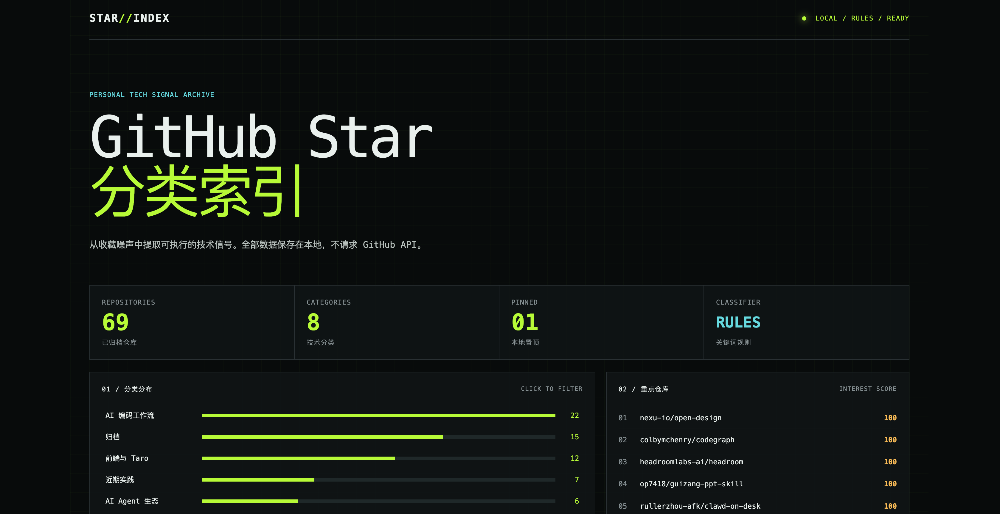
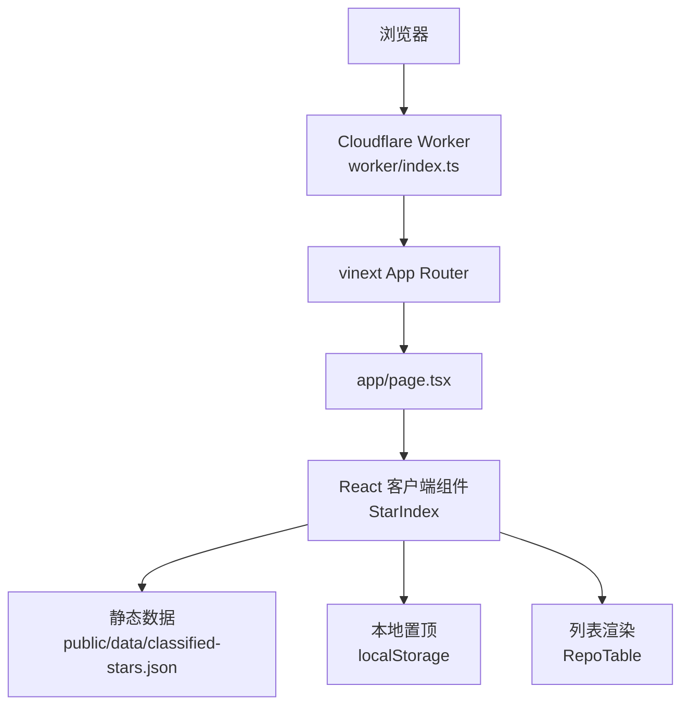

# StarForge

本地优先的 GitHub Star 分类索引站点。展示已归档仓库，支持关键词搜索、分类筛选、按兴趣分或 GitHub Star 排序，以及浏览器本地置顶。

## 项目截图



## 技术栈

- React 19 + Next.js 16 App Router
- vinext + Vite
- Cloudflare Worker
- TypeScript + CSS

## 快速开始

要求：Node.js `>=22.13.0`，已安装并登录 GitHub CLI。

```bash
npm install
gh auth login
npm run stars:refresh
npm run dev
```

浏览器打开终端输出的本地地址即可查看页面。

## 更新 Star 数据

```bash
npm run stars:refresh
```

脚本通过 `gh api user/starred --paginate --slurp -X GET -f per_page=100` 获取当前 GitHub 账号的全部 Star，将分页结果合并后按关键词分类、计算兴趣分，并原子覆盖 `public/data/classified-stars.json`。

不要直接执行 `gh api user/starred --paginate > public/data/classified-stars.json`：多页响应会生成多个独立 JSON 数组，且缺少页面需要的分类与兴趣分字段。

## 页面运行链路



首页加载后，`StarIndex` 请求静态 JSON；`app/lib/stars.ts` 负责统计、筛选和排序；`RepoTable` 渲染仓库列表。页面不会在浏览器中请求 GitHub API。

## 项目结构

```text
app/
  page.tsx                 首页入口
  components/StarIndex.tsx 页面交互与数据加载
  components/RepoTable.tsx 仓库列表渲染
  lib/stars.ts             分类统计、筛选与排序
  globals.css              页面样式
public/data/
  classified-stars.json    已分类 Star 数据
scripts/
  refresh-stars.mjs        GitHub 数据获取与转换
worker/index.ts            Cloudflare Worker 请求入口
```

## 常用命令

```bash
npm run dev            # 本地开发
npm run stars:refresh  # 更新 Star 数据
npm run build          # 生产构建
npm run start          # 启动生产服务
npm test               # 构建并运行测试
```
